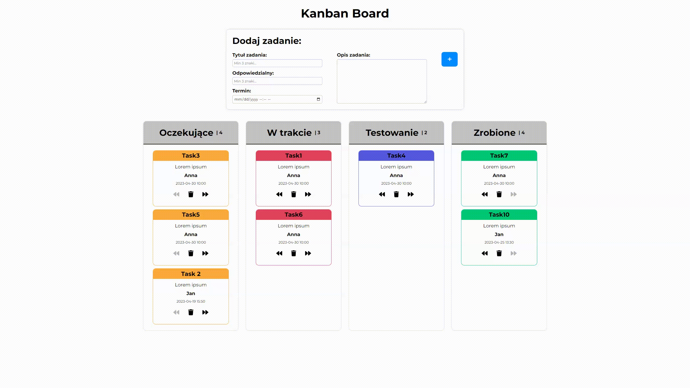

# Kanban Board



### Hi there! 👋 <br/>
Thanks for viewing my repository!
Let me introduce you to my Kanban Board app built with **React** combined with  [**ESLint Airbnb rules**](https://github.com/airbnb/javascript). <br/>

Kanban is a methodology widely used in many companies to develop software more efficiently. If you want to know more about it, I encourage you to read the article [*Kanban. How the kanban methodology applies to software development.*](https://www.atlassian.com/agile/kanban)

## 🔴 Live
Feel free to try the app live [here](https://mmcode9407.github.io/kanban-board/build/index.html)

## 📎 Features

- Creating *new tasks* with *description*;
- *Assigning a person* to the task;
- Setting *due date and time* of the task;
- Form validation;
- Task management:
    - *moving tasks between columns*;
    - *saving data in localStorage*;   
    - *deleting tasks*;
    
    
## 🔧 Built with


 <br/>


## ⚙️ Installation

The project uses [node](https://nodejs.org/en/) and [npm](https://www.npmjs.com/). To run the app on your machine you should install all dependencies. Then create a localhost port and run your web explorer.

Let's start with installing all dependencies. Move to the app main workspace and run:

    npm i

To create a localhost port you should type:

    npm run start

Your Kanban Board is ready at port 8080.

    http://localhost:8080/

## 🤔 Solutions provided in the project

- The app uses modern React features like **Hooks** and **Context API**. The entire app has been divided into components and all logic is maintained in `App.js`. It **allows moving tasks between columns if the limit in the next or previous column is not exceeded**.

- The `<App/>` component uses the **useState** hook for store tasks. `<Task/>` components are rendered based on this. State data is provided with `<Form/>` which is properly validated before sending. `<App/>` provides context to the `<Task/>`, `<Column/>`, and `<Form/>` where they are consumed.

- The `useReducer` hook is **used to control the form with user inputs**. Depending on the action, it updates the state with user inputs or clears the inputs.
```js
const reducer = (state, action) => {
    if (action.type === 'CLEAR') {
        return action.payload;
    }
    return {
        ...state,
        [action.name]: action.name === 'taskDeadline' ? action.value.replace('T', ' ') : action.value,
    };
};
```

- I use **localStorage** for storing data. For this purpose, I create my own hook called `useStorage` that allows you to work with localStorage (saving and downloading data). Data is retrieved from localStorage when the app is mounted and is saved when the browser tab is going to be closed. The data is also saved when working with tasks (move between columns or delete the task).
```js
const [setStorageTasks, getStorageTasks] = useStorage('tasks');
```

- It is also worth mentioning that **the columns are rendered dynamically** from a separate file. Thanks to this, the user can independently adjust the number, name, and limit of columns according to their own preferences.
```js
export const defaultColumns = [
    { id: 1, name: 'Oczekujące', limit: 4 },
    { id: 2, name: 'W trakcie', limit: 3 },
    { id: 3, name: 'Testowanie', limit: 2 },
    { id: 4, name: 'Zrobione', limit: 4 },
];
```

- The UI has been designed in a simple and minimalist way. The styles were added thanks to the CSS preprocessor called [**Sass**](https://sass-lang.com/).<br/>
Thanks to this and **the variables stored in the `variables.scss` module**, the user **can customize some elements of the application's appearance** (e.g. font family, font sizes, or colors)
    
## 💭 Improvements for future
- add rendering input dynamically;
- prepare the app for mobile

## 🙋‍♂️ Feel free to contact me
If you have any questions feel free to get in touch with me (contact in the [profile readme](https://github.com/mmcode9407)).

## 🙏 Special thanks
Special thanks to my [Mentor - devmentor.pl](https://devmentor.pl/) for providing me with the task and code review.
